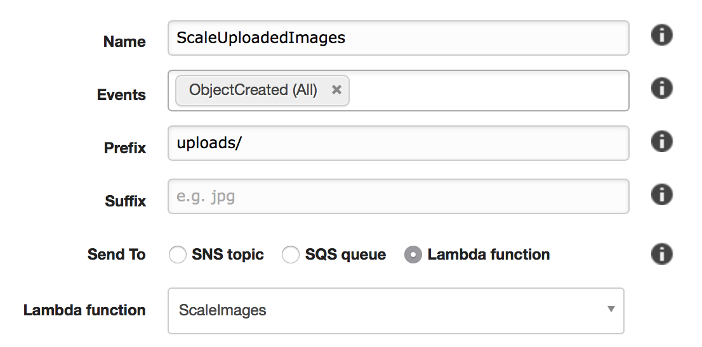

# Image Resize Lambda

Resizes images uploaded to a specific folder and uploads them to another folder in the same S3 bucket.

# Usage

`npm install`

If you want the files to be sent somewhere else than `/public`, change the `dstKey` variable in the `resize_photo` function. Make sure to NOT use the same folder as your event listens to.

Archive app.js and node_modules into a .zip file, and upload to AWS Lambda.

# Example S3 event config



# Example S3 public config

Expose files in the public folder to everyone. Perfect for asset hosting.

```json
{
	"Version": "2012-10-17",
	"Statement": [
		{
			"Sid": "AddPerm",
			"Effect": "Allow",
			"Principal": "*",
			"Action": [
				"s3:GetObject"
			],
			"Resource": [
				"arn:aws:s3:::pam-api-images-dev-ir/public/*"
			]
		}
	]
}
```
